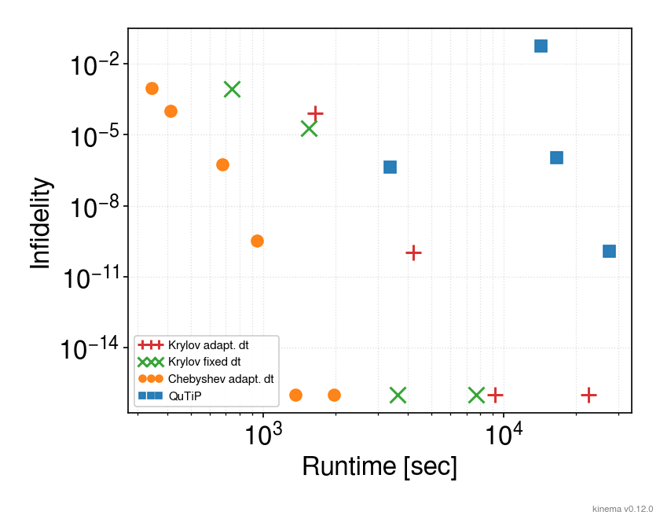
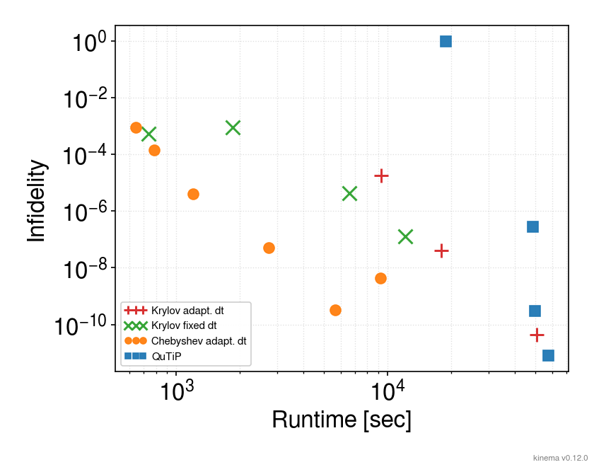

<div style="text-align: center;" align="center">

# `maqina`

A **Ma**gnus-based **Q**uantum **I**sing **N**umerical **A**nnealer

Matrix-free simulator for the transverse-field Ising model (TFIM) quantum dynamics.

**Links:** [Getting started](#getting-started)
— [Installation](#Installation)
— [Quickstart guide](./docs/quickstart.md)

</div>

---

- **Krylov (Lanczos)** short-time propagator approximation
- **Chebyshev polynomial expansion** short-time propagator approximation
  (current default; ~5× faster per-step wall than Lanczos)
- **CFM4:2 (commutator-free Magnus, 4th order)** for time-dependent
  Hamiltonian time evolution
- **Adaptive dt driver** (step-doubling Richardson + PI control)

Hamiltonian:

```
H(t) = A(s(t)) · H_driver + B(s(t)) · H_problem
H_driver  = -Σ_i h_x_i X_i              (site-dependent transverse field, bit-flip)
H_problem = a k-local polynomial in Z operators only (diagonal in the Z basis)
```

---

## Performance (work-precision diagram)

| Narrow dynamic range                                       | Wide dynamic range                                   |
| ---------------------------------------------------------- | ---------------------------------------------------- |
|  |  |

N=18, T=10000. Details are in
[`benchmarks/results/0.12.0/SUMMARY.md`](benchmarks/results/0.12.0/SUMMARY.md)
(Japanese only).

## Getting started

```python
import numpy as np
from maqina import IsingProblem, Schedule, QuantumAnnealer
from maqina.initial_states import uniform_superposition

n = 6
rng = np.random.default_rng(0)
J = rng.normal(size=(n, n)) / np.sqrt(n)
J = (J + J.T) / 2
np.fill_diagonal(J, 0.0)

# Diagonalize H_problem = -Σ_{i<j} J_ij Z_i Z_j in the Z basis.
# bit 0 = LSB, σ_i(x) = 1 - 2·b_i (see CLAUDE.md "physical conventions").
x = np.arange(1 << n, dtype=np.int64)
bits = ((x[:, None] >> np.arange(n)) & 1).astype(np.int64)
sigma = 1 - 2 * bits                                    # shape (2^n, n)
H_p_diag = -np.einsum("ij,xi,xj->x", J, sigma, sigma) / 2

prob = IsingProblem(n=n, H_p_diag=H_p_diag, h_x=np.ones(n))
sched = Schedule.linear(T=20.0)
psi0 = uniform_superposition(n)

ann = QuantumAnnealer(prob, sched)
result = ann.run(
    psi0,
    t0=0.0,
    t1=sched.T,
    atol=1e-8,
)

# Check the overlap with the ground state of H_p (classical Ising solution).
gs_index = int(np.argmin(prob.H_p_diag))
gs_probability = float(np.abs(result.psi_final[gs_index]) ** 2)
print(f"|<gs|ψ(T)>|² = {gs_probability:.4f}")
print(f"n_steps     = {result.n_steps_actual}")
```

Additional snippets for Observable time-series, step-wise simulator,
instantaneous eigenstates, and thread-count control for parallel jobs are
in [`docs/quickstart.md`](docs/quickstart.md).

## Requirements

- Python `>=3.13`
- Rust toolchain (`cargo`)
- macOS: Apple Accelerate is used automatically (no extra install)
- Linux: system OpenBLAS (`libopenblas-dev` etc.) is required
  (`--no-default-features` for a fallback build)

## Installation

Build from source and add to an existing project (no wheel distribution yet,
so source build is the only path):

```bash
# With uv (recommended):
uv add 'git+https://github.com/yusekiya/maqina'

# With pip:
pip install 'git+https://github.com/yusekiya/maqina'
```

The build configuration (which target features were enabled) can be checked
via `maqina.show_config()` (analogous to `numpy.show_config()`):

```python
>>> import maqina
>>> maqina.show_config()
maqina build configuration
--------------------------------------------------
  version       : 0.12.0
  ...
  target_features (reflects -C target-cpu=native):
    [ON ] avx2
    [ON ] fma
    [off] avx512f
    [off] neon
```

## Documentation

- **Quick start**: [`docs/quickstart.md`](docs/quickstart.md) — a tutorial
  covering the main API via 4 snippets: minimal example, Observable
  time-series, step-wise simulator, instantaneous eigenstates. Also covers
  thread-count control for parallel jobs (multiprocessing / Slurm).
- Design docs (primary source): [`docs/design/INDEX.md`](docs/design/INDEX.md)
  (Japanese only)
- Test execution: [`.claude/skills/test-runner/SKILL.md`](.claude/skills/test-runner/SKILL.md)
  (Japanese only; Claude Code skill, invocable as `/test-runner`;
  `docs/testing.md` is a pointer)
- Benchmarks: [`docs/benchmarks.md`](docs/benchmarks.md) (Japanese only;
  not yet maintained in Phase 1)
- API reference: `python/maqina/*.pyi` (per-module PEP 484 stubs with full
  docstrings, mostly in Japanese; auto-generated by `tools/gen_api_stubs.py`)

## Development

Local development workflow after cloning the repo. `maturin develop` builds
the Rust extension `maqina._rust` and places it directly under
`python/maqina/`:

```bash
uv sync
uv run maturin develop --uv             # debug build (--uv is required for uv venv)
uv run maturin develop --uv --release   # for performance measurement
```

The `--uv` flag tells maturin to use `uv pip install` instead of `pip install`
when installing the wheel. The venv that uv creates does not bundle pip, so
without `--uv` you will hit `No module named pip`.

After changing `src/*.rs`, **always run `uv run maturin develop --uv` once
before `uv run pytest`**. Otherwise the stale `_rust.so` is loaded and Rust
changes are not reflected in tests.

For details on tests / lint / build commands see
[`.claude/skills/test-runner/SKILL.md`](.claude/skills/test-runner/SKILL.md)
(Japanese only; invocable as `/test-runner`).

## References

- [Ido Schaefer, Hillel Tal-Ezer and Ronnie Kosloff, "Semi-global approach for propagation of the time-dependent Schrödinger equation for time-dependent and nonlinear problems", Journal of Computational Physics 343, 368 (2017).](https://doi.org/10.1016/j.jcp.2017.04.017)
- [Sergio Blanes, Fernando Casas and Mechthild Thalhammer, "High-order commutator-free quasi-Magnus exponential integrators for non-autonomous linear evolution equations", Computer Physics Communications 220, 243 (2017).](https://doi.org/10.1016/j.cpc.2017.07.016)
- [Arieh Iserles, Karolina Kropielnicka, and Pranav Singh, "Magnus--Lanczos Methods with Simplified Commutators for the Schrödinger Equation with a Time-Dependent Potential", SIAM Journal on Numerical Analysis 56, 1547 (2010).](https://doi.org/10.1137/17M1149833)
- [Andreas Alvermann and Holgera Fehske, "High-order commutator-free exponential time-propagation of driven quantum systems", Journal of Computational Physics 230, 5930 (2011).](https://doi.org/10.1016/j.jcp.2011.04.006)

## License

MIT License. See [`LICENSE`](LICENSE) for the full text.
